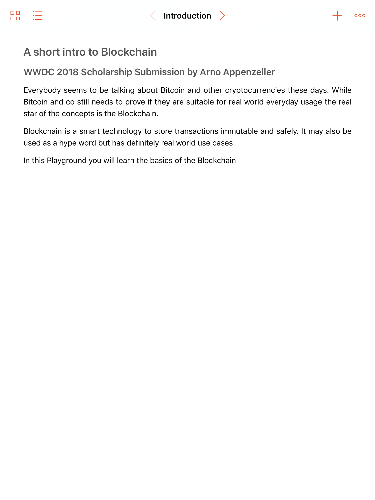
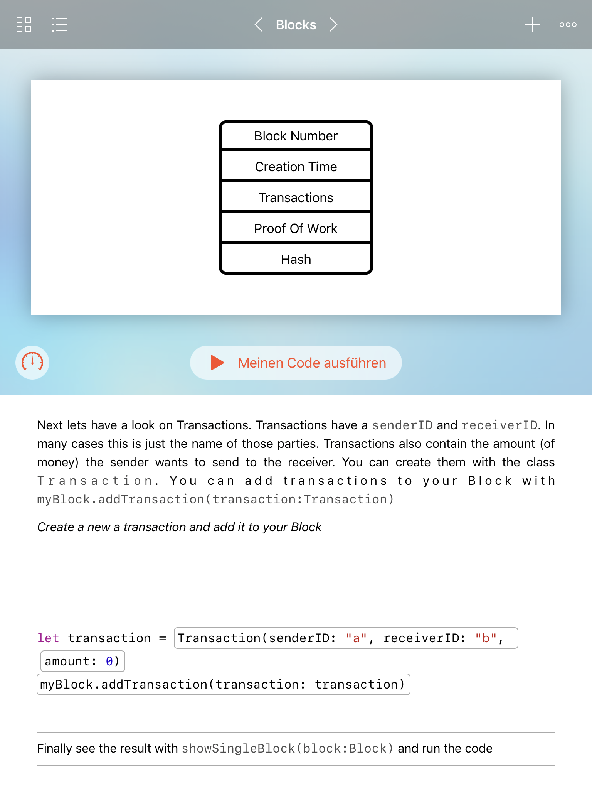

# WWC18-Scholarship-Submission
This is my Swift Playgroundbook for WWDC18 Scholarship

I made a Playground that teaches the user about Blockchain technology (yeah I know hype train 🚅 but still an interesting technology).

You can run this Playgroundbook in the iOS Playground app

Here are some impressions:

